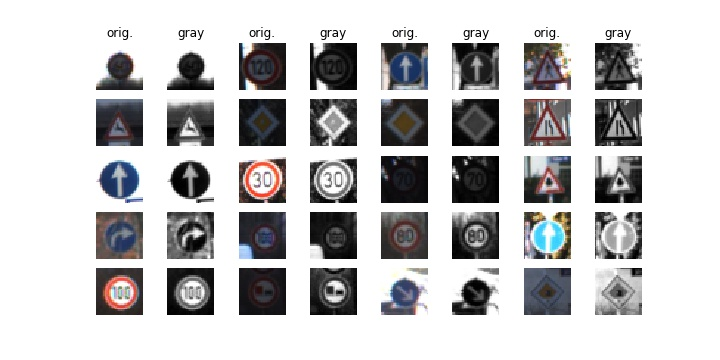
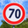
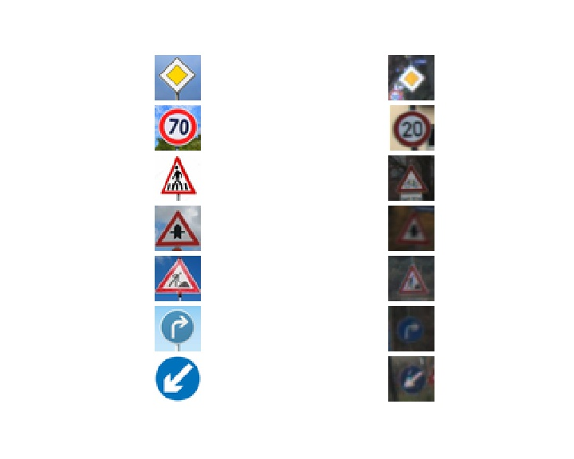
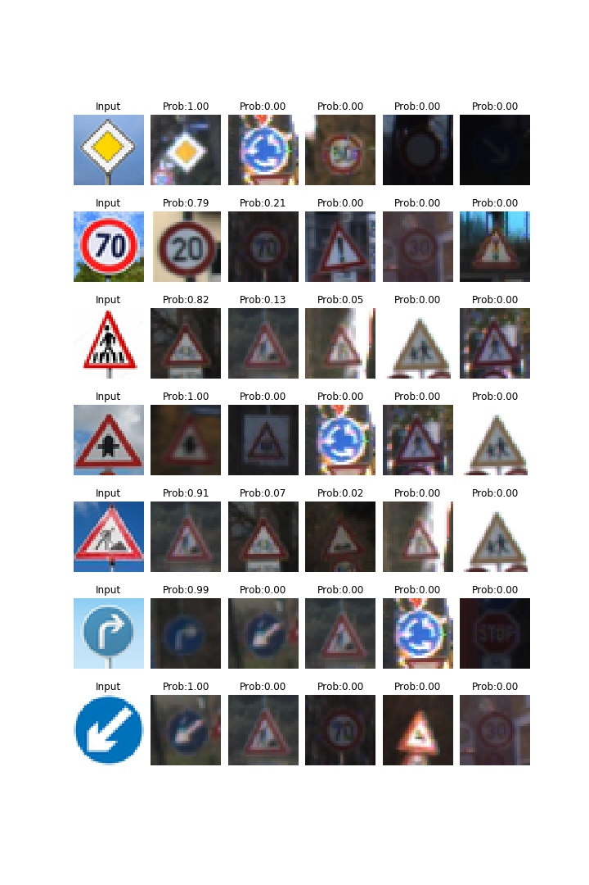

# **Traffic Sign Recognition** 

## Writeup

---

**Build a Traffic Sign Recognition Project**

The goals / steps of this project are the following:
* Load the data set (see below for links to the project data set)
* Explore, summarize and visualize the data set
* Design, train and test a model architecture
* Use the model to make predictions on new images
* Analyze the softmax probabilities of the new images
* Summarize the results with a written report


[//]: # (Image References)

[image1]: ./examples/visualization.jpg "Visualization"
[image2]: ./examples/grayscale.jpg "Grayscaling"
[image3]: ./examples/random_noise.jpg "Random Noise"
[image4]: ./examples/placeholder.png "Traffic Sign 1"
[image5]: ./examples/placeholder.png "Traffic Sign 2"
[image6]: ./examples/placeholder.png "Traffic Sign 3"
[image7]: ./examples/placeholder.png "Traffic Sign 4"
[image8]: ./examples/placeholder.png "Traffic Sign 5"

## Rubric Points
### Here I considered the [rubric points](https://review.udacity.com/#!/rubrics/481/view) individually and describe how I addressed each point in my implementation.  

---
### Writeup / README

#### 1. My project github link

Here is a link to my [project code](https://github.com/diwakarindoria/CarND-Traffic-Sign-Classifier-Project/blob/master/Traffic_Sign_Classifier.ipynb)

### Data Set Summary & Exploration

#### 1. Basic summary of the data set.

I used the pandas library to calculate summary statistics of the traffic
signs data set:

* The size of training set is 34799
* The size of the validation set is 4410
* The size of test set is 12630
* The shape of a traffic sign image is (32, 32, 3)
* The number of unique classes/labels in the data set is 43

#### 2. Include an exploratory visualization of the dataset.

Here is an exploratory visualization of the data set. Its related code is given in `Include an exploratory visualization of the dataset` cell.

**Visualization of randon images from dataset**

Please find some random images from the training dataset, this will let us know about the content of training images data sets.

Visualization of random images:
[](random_visualization_img.jpg)

The above images shows us that training data set has not good images quality. Some of images are blurred and some of too dark. Some images are taken in low light conditions are some of are in high. These images could affect the leaning or training to the model and the results as well.

### Design and Test a Model Architecture

#### I. Preprocessing: conversion to grayscale

As a first step, I decided to convert the all images to grayscale because there is nothing discrete information added by color in signs by which it helps to distinguish about sign. Secondly, many of pictures are taken in bad light conditions, some of too dark and some of too light, so using grayscaling, it shows better visuality in grayed images. Another reason is, training of the model processing is faster in grayscaled images.

Showing the grayed images code is available in first cell of `Pre-process the Data Set (normalization, grayscale, etc.)`. Function name is `show_my_img()`.

Converting all images to grayscaled code is available in second cell of `Pre-process the Data Set (normalization, grayscale, etc.)` through lines 12 to 24. Function name is `grayscale()`.

Here is an example of a traffic sign image before and after grayscaling. I am  showing random images from dataset, first color image and grayed image after it one by one.

Visualization of grayed images:
[](gray_visualization_img.jpg)


#### II. Preprocessing: Image Normalization

Images normalization is the next step of preprocessing. Using this images will have zero mean and equal variance. Normalization helps optimizer in converging faster and better results.

Its code is available in second cell of `Pre-process the Data Set (normalization, grayscale, etc.)` through lines 26 to 29.


```
# Normalization
normalized_X_train = (gray_X_train-128)/128
normalized_X_valid = (gray_X_valid-128)/128
normalized_X_test = (gray_X_test-128)/128 
```

In the same cell a function is created to show the sample of the normalize image. Function `show_normalize()` and its calling code is available through lines 31 to 44.

Here is an example of an original image and an normalized image:
[](normalized_and_grayscaled.jpg)


#### III. Preprocessing: Image Shuffling

Image shuffling is the last step of the preprocessing. Shuffle data is necessary to train model better.

Its code is available in second cell of `Pre-process the Data Set (normalization, grayscale, etc.)` at line 47


```
# Shuffle
shuffled_X_train, shuffled_y_train = shuffle(normalized_X_train, y_train)
```

#### 2. Final Model Architecture (model type, layers, layer sizes, connectivity, etc.)

Code for final model architecture is available in section `Model Architecture` which has several code cells one by one.

My final model consisted of the following layers:

| Layer         						|     Description	        						| 
|:---------------------:				|:---------------------------------------------:	| 
| Input         						| 32x32x3 RGB image   								| 
| Layer 1(L_1): Convolution 3x3     	| 1x1 stride, same padding, outputs 32x32x64 		|
| Layer 1(L_1): RELU					| Activation Layer									|
| Layer 1(L_1): Max pooling	      		| 2x2 stride,  outputs 16x16x64 					|
| Layer 2(L_2): Convolution 3x3			| 1x1 stride, same padding, outputs 16x16x128		|
| Layer 2(L_2): RELU					| Activation Layer									|
| Layer 2(L_2): Max pooling	      		| 2x2 stride,  outputs 8x8x128 						|
| Layer 3(L_3): Convolution 3x3	    	| 1x1 stride, same padding, outputs 8x8x256			|
| Layer 3(L_3): RELU					| Activation Layer									|
| Layer 3(L_3): Max pooling	      		| 2x2 stride,  outputs 4x4x256 						|
| Layer 4(L_4): Convolution 3x3	    	| 1x1 stride, same padding, outputs 4x4x512			|
| Layer 4(L_4): RELU					| Activation Layer									|
| Layer 4(L_4): Max pooling	      		| 2x2 stride,  outputs 2x2x512 						|
| Flatten Layer (flatten(L_4)	      	| Flattening output of Layer 4, 2x2x512 -> 2048 	|
| Flatten Layer (Dropout)	      		| Dropout layer 									|
| Layer 5(L_5): Fully Connected	    	| Fully connected layer of size 1024, outputs 1024x1|
| Layer 5(L_5): RELU	      			| Activation Layer 									|
| Layer 5(L_5): Dropout	      			| Dropout layer 									|
| Fully connected						| Fully connected layer of size 43, outputs 43x1	|
 


#### 3. Training model parameters(optimizer, the batch size, number of epochs) and hyperparameters(learning rate etc.)

The below credentials are used to train the model.
* optimizer: Adam Optimizer
* the batch size: 128
* number of epochs: 15
* learning rate: 0.001
* loss function: Cross entropy
* probability: 0.5 (during training)
* weights & biases: tf.truncated_normal (mean = 0, and standard deviation = 0.1)

#### 4. Approach taken for finding a solution

My final model results were:
* training set accuracy of 0.998
* validation set accuracy of 0.961
* test set accuracy of 0.948

Its related code is available in section `Train, Validate and Test the Model` which has 2 cells. In first cell, we are training the model and in second cell we are calculating and printing the accuracy.

I chose well known CNN architecture vgg-16. The reason behind to choose this architecture is:
* It achieved excellent results on the ILSVRC-2014 (ImageNet competition). As it performed nice in competition, I got idea to implement it into my current task for traffic sign classification so I can get better results.
* Another reason is it's implementation is easy.
* Final model's accuracy on the training, validation and test set was really well. It performed good to get accuracy more than 0.93
 

### Test a Model on New Images

#### 1. Download new traffic signs images from web

Here are seven German traffic signs that I found on the web:

[](new_images/g1.jpg)
[](new_images/g2.jpg)
[](new_images/g3.jpg)
[](new_images/g4.jpg)
[](new_images/g5.jpg)
[](new_images/g6.jpg)
[](new_images/g7.jpg)

I applied the trained model over all images that found on web. Out of 7 images, 5 images predicted correct and 2 images predicted wrong but their probability differene betweeen right and wrong was less.

#### 2. Model's predictions on these new traffic signs.

Here are the results of the prediction:

| Image			        |     Prediction	        					| 
|:---------------------:|:---------------------------------------------:| 
| Priority road      		| Priority road   									| 
| Speed limit (70km/h)     			| General caution										|
| Pedestrians					| Bicycles crossing											|
| Right-of-way at the next intersection	      		| Right-of-way at the next intersection					 				|
| Road work			| Road work      							|
| Turn right ahead			| Turn right ahead      							|
| Keep left			| Keep left      							|


The model was able to correctly guess 5 of the 7 traffic signs, which gives an accuracy of 71%. These two images are `Speed limit (70km/h)` and `Pedestrians`. As I am assuming that model is not enough trained for detecting these signs and need more examples to learn.

Its code is available in section `Predict the Sign Type for Each Image`. 
[](prediction_performance.jpg)

#### 3. Top predictions

The code for making predictions on my final model is located in the `Output Top 5 Softmax Probabilities For Each Image Found on the Web` section of the Ipython notebook.

The input downloaded images and the top soft max probabilities are showing in below table.

| Probability         	|     Prediction	        					| 
|:---------------------:|:---------------------------------------------:| 
| 1.00         			| Priority road    									| 
| 0.40 (0.38 for correct image)    				| Speed limit (70km/h) 										|
| 1.00 (No correct image)					| Pedestrians											|
| 1.00	      			| Right-of-way at the next intersection					 				|
| 1.00				    | Road work      							|
| 1.00				    | Turn right ahead      							|
| 1.00				    | Keep left      							|

Its related code is available in section `Output Top 5 Softmax Probabilities For Each Image Found on the Web`. 

[](output_images_top/top_predictions.jpg)

### (Optional) Visualizing the Neural Network (See Step 4 of the Ipython notebook for more details)
#### 1. Discuss the visual output of your trained network's feature maps. What characteristics did the neural network use to make classifications?


